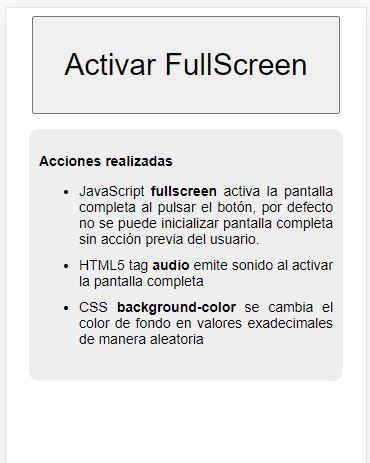

# Full Screen & Random Colors

> Al pulsar el botón se activa la pantalla completa, el audio de fondo y una función que cambia el fondo de la pantalla de manera aleatoria cada 180 mili segundos.

**Acciones realizadas**
- JavaScript <strong>fullscreen</strong> activa la pantalla completa al pulsar el botón, por defecto no se puede inicializar pantalla completa sin acción previa del usuario.
- HTML5 tag <strong>audio</strong> emite sonido al activar la pantalla completa.
- CSS <strong>background-color</strong> se cambia el color de fondo en valores exadecimales de manera aleatoria

Demo: [Full Screen & Random Colors](http://marco.presting.pro/GitHub/FullScreenColors)

